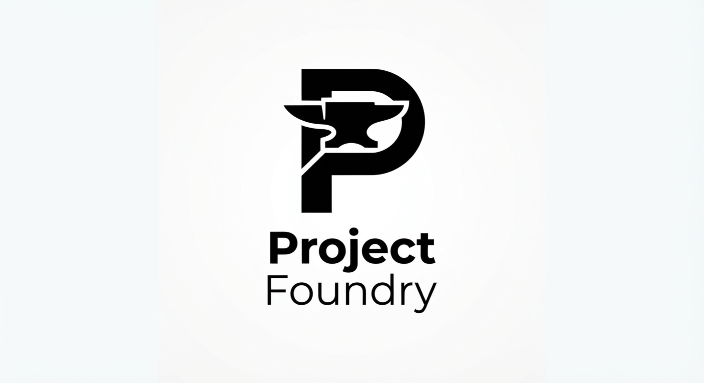

<p align="center">
  
</p>

<p align="center">
  <b>AI-Native Project Intelligence, Research, Architecture, Specification, Budgeting, Documentation, and Implementation Planning System</b>
</p>

<p align="center">
  <a href="./LICENSE"></a>
  
</p>

---

## What is ProjectFounder?

ProjectFounder transforms an incomplete project idea into a structured, researched, validated, budgeted, documented, and implementation-ready project.

You give it something as simple as:

> "I want to build a bookmark app like Raindrop, with AI search and a browser extension."

And it progressively turns that idea into:

```text
RAW IDEA
   ↓
PROJECT CLASSIFICATION
   ↓
DISCOVERY → RESEARCH → RESOURCE DISCOVERY → GAP ANALYSIS
   ↓
FEATURE DISCOVERY → REQUIREMENTS → ARCHITECTURE
   ↓
AI / AGENT / MCP DESIGN
   ↓
SECURITY / DATA / API / INFRASTRUCTURE
   ↓
BUDGET / TCO / BUSINESS MODEL
   ↓
DOCUMENTATION PLAN → VALIDATION → ROADMAP → TASKS
   ↓
IMPLEMENTATION-READY PROJECT
```

ProjectFounder is **not** simply an AI chatbot, a project generator, a documentation generator, a research agent, or a task manager. It is a **project intelligence system** that coordinates all of those capabilities and hands off a fully-contexted project to a coding agent (Claude Code, Codex, Cursor, etc.) so implementation can begin without rediscovering the project from scratch.

The full vision, engine inventory, artifact model, and v0.1 implementation contract are specified in **[`ProjectFounder-idea.md`](./ProjectFounder-idea.md)** — the canonical, primary artifact of this repository.

## Core principle

> **Technology is replaceable data; project knowledge is the durable asset.**

Changing the database, the AI provider, or the frontend framework should never require redesigning ProjectFounder. Project knowledge — requirements, decisions, research, architecture — is the thing that persists.

```text
Project Knowledge = Durable
Technology Choice = Replaceable
Research           = Refreshable
Architecture       = Evolvable
Artifacts          = Versioned
Decisions          = Traceable
```

## How it's organized

ProjectFounder separates **engines** (active capabilities that process information) from **artifacts** (persistent project knowledge those engines read and write):

| Concept | Meaning |
|---|---|
| **Engines** | Intelligence and processing capabilities (Research, Architecture, Budget, Security, Validation, …) |
| **Artifacts** | Persistent outputs/data produced or maintained by engines (`SPEC.md`, `ARCHITECTURE.md`, `BUDGET.md`, …) |
| **Resources** | Replaceable technology/provider knowledge (languages, databases, AI providers, hosting) |
| **Policies** | Rules controlling engine behavior (research depth, budget limits, AI/agent governance) |
| **Schemas** | Machine-readable contracts that validate artifacts |
| **Workflows** | Orchestration of engines/agents/skills into a repeatable process |
| **Agents** | Execution roles (research, architecture, security, documentation, validation, …) |
| **Skills** | Reusable procedures an agent can invoke |
| **Project state** | The source of truth about where a project currently is (lifecycle, mode, readiness) |

## Repository layout

```text
ProjectFounder/
├── AGENT.md                  # Master operational contract for ProjectFounder itself
├── AGENTS.md                 # Repo-wide conventions for any coding agent working in this repo
├── CLAUDE.md                 # Claude Code-specific adapter
├── ProjectFounder-idea.md    # Canonical v0.1 specification (the primary artifact)
├── docs/                     # This repo's own docs (CHANGELOG, TASKS, meta-research) — not project output
├── config/                   # Policy configuration (research, budget, AI, agent, lifecycle, …)
├── agents/                   # Agent role contracts (research-agent, architecture-agent, …)
├── skills/                   # Reusable skill procedures (research, gap-analysis, security, …)
├── workflows/                # Orchestration definitions (new-project, saas, mobile, …)
├── resources/                # Resource Intelligence catalog (replaceable tech knowledge)
├── templates/                # Document/artifact templates by domain
├── schemas/                  # Machine-readable contracts for every artifact type
├── checks/                   # Automated validation checks / quality gates
├── commands/                 # User/agent-invokable commands
├── examples/                 # Worked examples (e.g. the bookmark-manager user journey)
├── output/                   # Generated projects land here (git-ignored contents)
└── assets/                   # Branding assets (icon, etc.)
```

This mirrors the structure defined in `ProjectFounder-idea.md` § *Repository Structure*.

## Status

This repository is currently a **v0.1 scaffold**, with Phase 0 (Foundation) underway: the Project Engine has a working, agent-executed slice — `commands/new-project.md` → `workflows/new-project.md` → `agents/project-architect.md` — that founds and classifies a new project up through `PROJECT.yaml` at lifecycle `CLASSIFIED`. It runs as a coding-agent-followed contract, not as code (see `docs/DECISIONS.md` D005). Everything past that (Discovery onward) is still specification only — see `ProjectFounder-idea.md` § *v0.1 Minimum Viable Definition* and § *v0.1 Implementation Phases* for the build order, and `docs/LIMITATIONS.md` for what doesn't work yet.

The spec has one amendment set so far — `ProjectFounder-idea.md` § 163 *v0.1.1 Amendments*, informed by external research on the spec-driven-development field (`docs/research/`) — covering delta-scoped changes, brownfield exploration, human-readable artifacts, and executable validation.

See [`docs/`](./docs/) for this repo's own documentation — build backlog, changelog, decisions, assumptions, constraints, non-goals, open questions, and known limitations.

## License

[MIT](./LICENSE)
